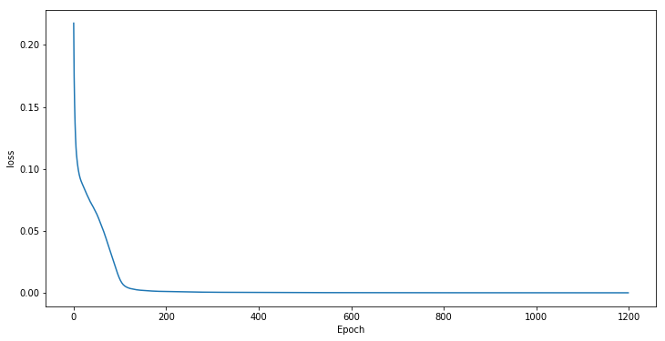
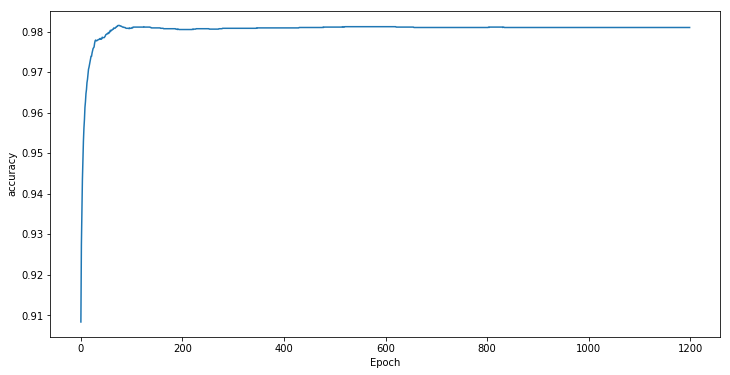

# Using MLP to Recognize Handwritten Numbers
## Environment
Platform:  Windows / Linux  
Packages:  Numpy + Matplotlib  
## Dataset
[MNIST](yann.lecun.com/exdb/mnist/)
## Usage  
Running the Mnist.ipynb file  
## Parameters
lr: learning rate  
batch: batch size  
epoch: the number of training rounds  
cell _ num1 / cell _ num2 / cell _ num3: the number of neurals in three hidden layers
## Experiment Results
### Training Loss  
Minimum Loss: 0.096  
  
## Testing Accuracy
Maximum Accuracy: 0.949  

